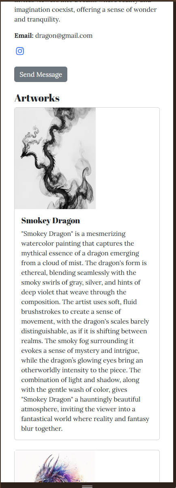
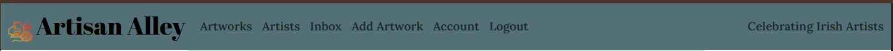

# Artisan Alley - Connect with Artists in Ireland

Artisan Alley is a directory of local arts and crafts market in Ireland. The site is built using Django, Python, and Postgres database for the portfolio project 4 of Code Institute's Full Stack Development Diploma.

Live Link: https://artisanalley-11b7201d6523.herokuapp.com/

## User Experience - UX

### Strategy

I have always loved arts and crafts and often wanted to combine my love for both arts and technology to create something helpful and meaningful. On my research I found out, there is no common platform where one can find out all kinds of artisans available in Ireland. I attended two exhibitions Art Source and Gifted that happened last year on different times where I discovered amazing crafts available Ireland. Hence the inspiration to create a platform to search for these artists.

#### User Stories

All user stories can be found in the linked [Github project](https://github.com/users/hennasingh/projects/6).

### Scope

This was a sprint work till the last day. I had a highlevel plan for my project, but it evolved as and when I discovered possibilities of Django and my desire to understand more features. I did divert from my initial original plan based on time and my knowledge but I am proud of what I accomplished.

Overall, this site aims to develope an online directory of all kinds of artists available in Ireland. The platform provides features for user registeration, authentication, artworks creation, profile management, and messaging. More details in the features section.

- Artworks Page - This page lists all the artworks posted by registered artists on the website.
- Artists Page - The page lists all artists registered on the website.
- Login/Register - To post artworks you are required to register on the site

### Skeleton

The wireframes for mobile and desktop were created using Balsamiq. These were the original ideas but they changed as I learned and progressed in the actual development of the website. Some of the features will be implemented in future versions.

Home Page - Artists

Artworks - Art Listings

Artist Profile

Signup

Log In

## User Interface - Surface

### Typography

ChatGPT suggestion was taken into account on choosing the font for the website.
Abril Fatface (headers) + Lora (body) Google fonts are used.

### Colors

Color scheme suggestions were taken from Coolers on uploading an image from Freepick.

Color Palette 

### Database Schema

This was the original schema that I had planned, but a lot changed as I understand more about Django, implemented new features and discarded others.

#### Models

1. Allauth User Model

The User model is part of Django Allauth. The model comes with predefined fields such as username, email, name, password, and more. This model is used for user authentication, and hence changes to this model are not advised. The User model has a one to one relationship with the Profile model.

2. Profile Model

This is a custom model to manage the Artist profile details. Django signals are used to reflect the changes between the User and Profile models. For example, if a user profile is deleted, user also gets deleted from the User model.

3. Artworks or ArtListing Model

The artwork model has one to many relationship with the profile Model as a profile can have multiple artworks. It is connected using profile_id Foreign Key.

4. Favorites Model

This model stores favorites for each profile. It is connected via Foreign Key profile_id and artwork_id to Profile and Artwork models respectively. #

5. Tag Model

This model stores tags an artist can add to its artwork.

## Agile Methodology

### Overview

This was my first full-stack application and there was a huge learning curve on both technology and process. I attempted following Agile principles to plan features of my site. I add initial user-stories and acceptance criteria to outline the requirements of the project but a lot changed as I progressed working on it.

### EPICS (Milestones)

I grouped user-stories in milestones but I struggled to vision all stories and milestones when I began the project. Some I created as I kept working on it and made edits as required.

### MoSCoW prioritization

I came to know about this strategy while looking at Github profiles and I wanted to try using it for my project so I could effectively prioritize features and requirements of the project based on importance. I wont say I succeeded with the approach but it was a good learning experience.

### Github Projects

The Kanban Board was created to keep track of different user stories and their progress. Columns such as Todo, In Progress, Done, were added to visualize the workflow.

### User Story Issues

The structure of the user story issue consists of the user-story, acceptance criteria, and tasks required to complete the issue. Wherever possible, the commit messages were connected to the corresponding issues that does let to larger commits.

## Site Features And Responsiveness

Main Site Features have been listed

### Artworks Page - Desktop

### Artworks Page - Mobile

### Artists Page - Desktop

### Artists Page - Mobile

#### Artist Profile - Desktop

#### Artist Profile - Mobile

#### Create/Edit Artwork - Desktop

#### Create/Edit Artwork - Mobile

#### Artist Acount - Desktop

#### Artist Account - Mobile

#### Login

#### Register

#### Navbar

#### Footer and Pagination

## Future Implementations

1. I would like to improve UI/UX of the website and make it more user friendly and visually appealing. The current objective was to focus on Django functionality and processes.
2. I would like to improve image display and restrict image size upload.
3. I would like to add Email functionality. There should be welcome email when you join the platform and option to email artists. Starting 2025 Google deprecated less secure apps functionality that allowed third party service integration and now only supports integration through OAuth.
4. I would like to add favorite functionality. Originally it was part of the plan, but due to less time, I added message functionality instead.
5. An option to follow and artist, will also be added.
6. An option to reset passwords will be added.
7. An option to delete and account will be added.

## Testing

Testing documentation can be found [here](./Testing.md)

## Technologies and Languages

### Languages Used

- HTML
- CSS
- JavaScript
- Bootstrap
- Python
- Django

### Technologies and Programs

- [Favicon Generator](https://favicon.io/favicon-converter/) for generating Favicon
- [Github](https://github.com/) for site hosting
- [Git](https://git-scm.com/) for version control
- [Coolors.co](https://coolors.co/) for color scheme
- [Google Fonts](https://fonts.google.com/) for headings and body font
- [Balsamiq](https://balsamiq.com/) for designing wireframes for desktop and mobile
- [Font Awesome](https://fontawesome.com/icons) - For icons in header, and social icons in footer and artist profile
- [ChatGPT](https://chat.openai.com/) - for text on Artisan Alley, and debugging CSS and HTML code
- [Cloudinary](https://cloudinary.com/) For Image Storage

## Deployment

### Deployment on Heroku

- To deploy on Heroku, create an account
- Create a new app, specify name, and region.
- On the next page, click on settings tab, and scroll down to Config Vars. Any API /secret keys are added here. The project requires credentials for:
  1. Postgres Database URL
  2. Cloudinary API URL
- Then come to Deploy App, connect the app from Github, search Repository and connect Heroku to Github Code
- Click on Deploy and wait for app to be built.Once this is done, a message that the app was successfully deployed with a view button to see the app wil be displayed.

### Local Clones or Fork

- Navigate to the project repository.
- Click on the green "Code" button and local tab as shown below:

- There are 3 methods provided to clone 'HTTPS', 'SSH',or 'Github Cli' that requires you to copy the repository link and type `git clone`in your terminal (mac) or command prompt (windows) in the chosen directory.
- The 4th option requires you to install Github Desktop and you can open the repository in your chosen local directory.
- The other option is to Fork the repository as shown in top right of the snapshot above. This will create a copy of repo in your own Github and you can make changes making this repo as a starting template.

## Credits

### Code Used

- [Dennis Ivy](https://github.com/divanov11/Django-Course/tree/master) for Django course and project code. Parts of UIs were inspired by his project code
- [Daayana' Code](https://github.com/Dayana-N/AutoMarket-PP4/blob/main/listings/templates/listings/listing_form.html) for introduction to Django widget tweaks and creating forms
- [Daayana's Code](https://github.com/Dayana-N/AutoMarket-PP4/milestones) for introduction to Epics and Milestones

### Content

- [chatGPT](https://chat.openai.com/) for text on Artisan Alley, Image Carousel Code
- [Django Widget Tweaks](https://www.youtube.com/watch?v=ynToND_xOAM) for learning how to use

### Media

- [Freepick](https://www.freepik.com/) for hero and artwork (quilling, jewellery) images
- [Font Awesome](https://fontawesome.com/search?ic=free) for social media icons

## Acknowledgements

- I would like to thank [Code Institute](https://codeinstitute.net/) Tutor team for their assistance with troubleshooting and debugging some project issues
- I would like to thank Claudia, a peer in the Code Institute course for pushing me during periods of self-doubt.
- My friend Stennie, for believing in me and constant encouragement.
