# Artisan Alley - Testing

This page contains all the testing details the website was run through

## Code Validation

### HTML

| Page                | Screenshot                                                              | Result    |
| ------------------- | ----------------------------------------------------------------------- | --------- |
| Home                | 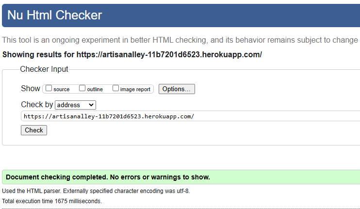               | Pass      |
| Artists             | 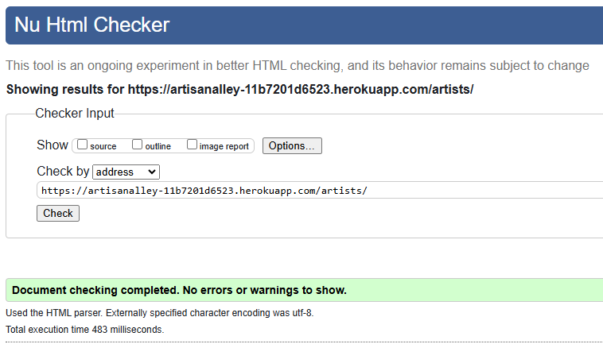        | Pass      |
| Single- Artwork     | 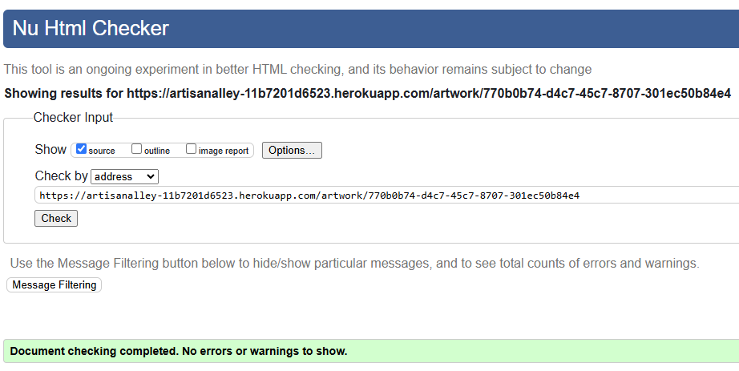      | Pass      |
| Artist Profile      | 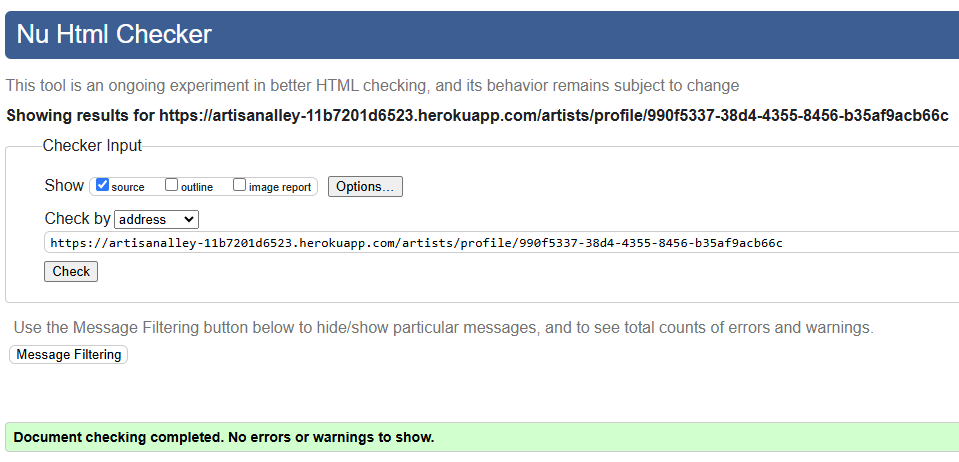 | Pass      |
| Login               | 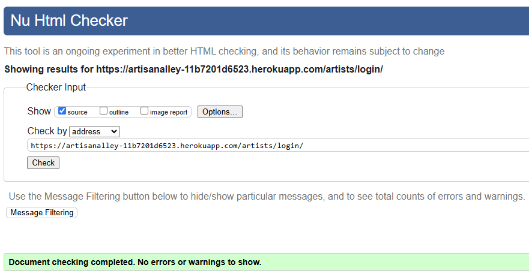                  | Pass      |
| Register            | 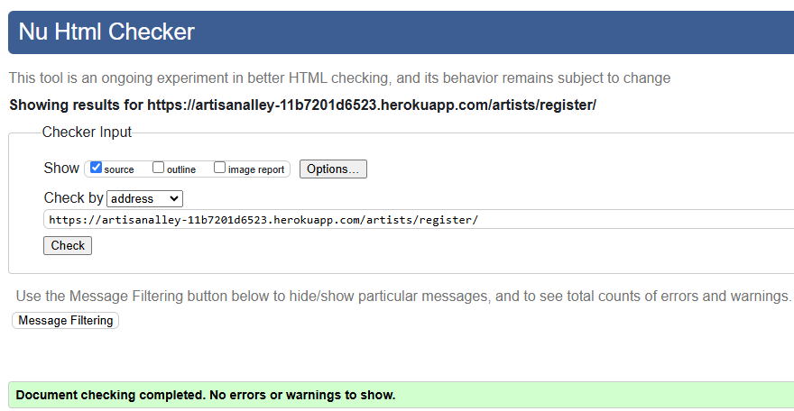            | Pass      |
| Create/Edit Artwork | 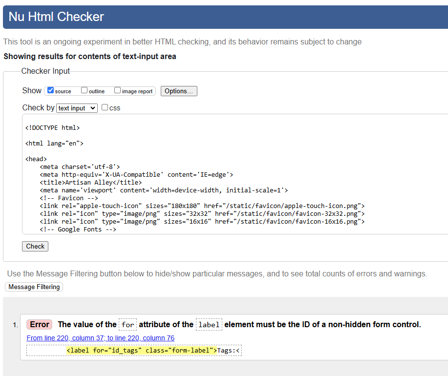        | Bug (#26) |
| Account             |            | Pass      |
| Inbox               | 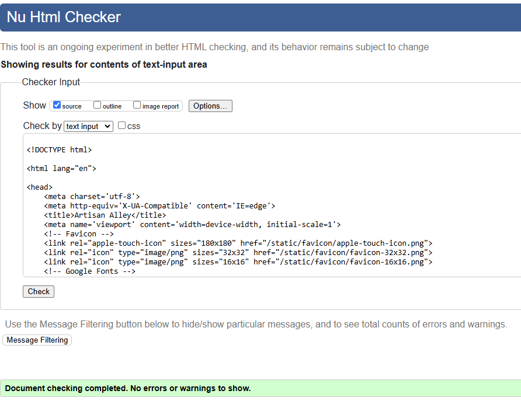                  | Pass      |
| Create/Edit Account | 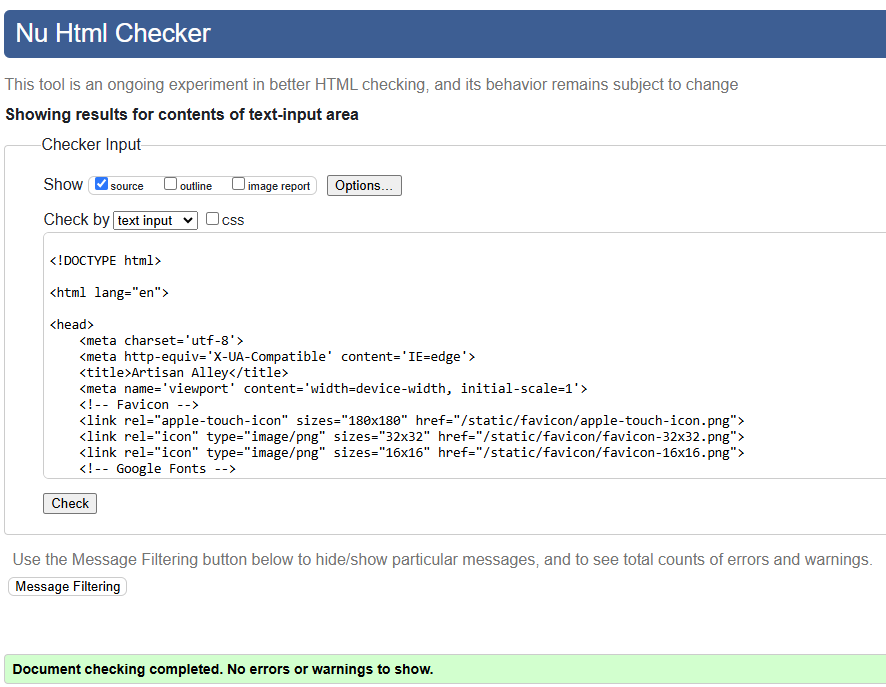     | Pass      |
| Send Message        |          | Pass      |
| Delete Artwork      | 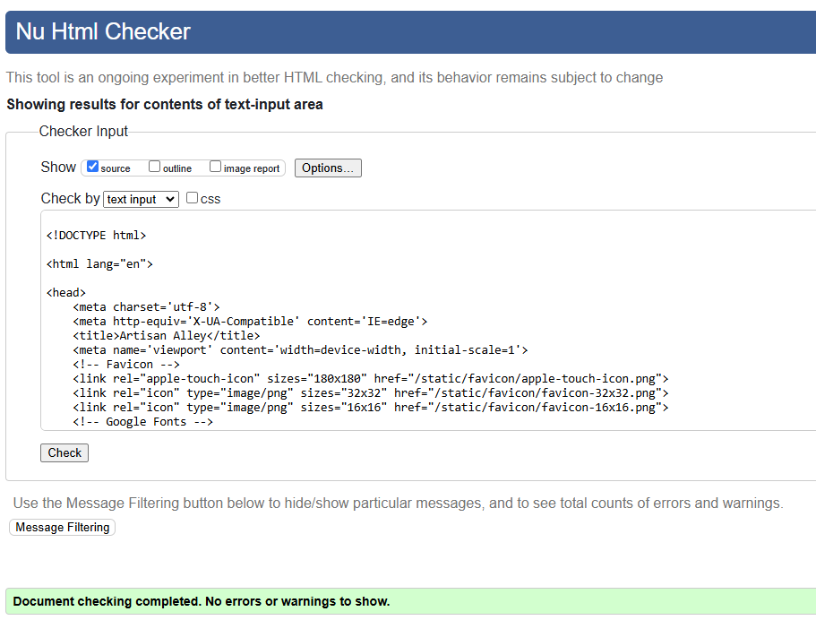        | Pass      |
| Error Pages         | 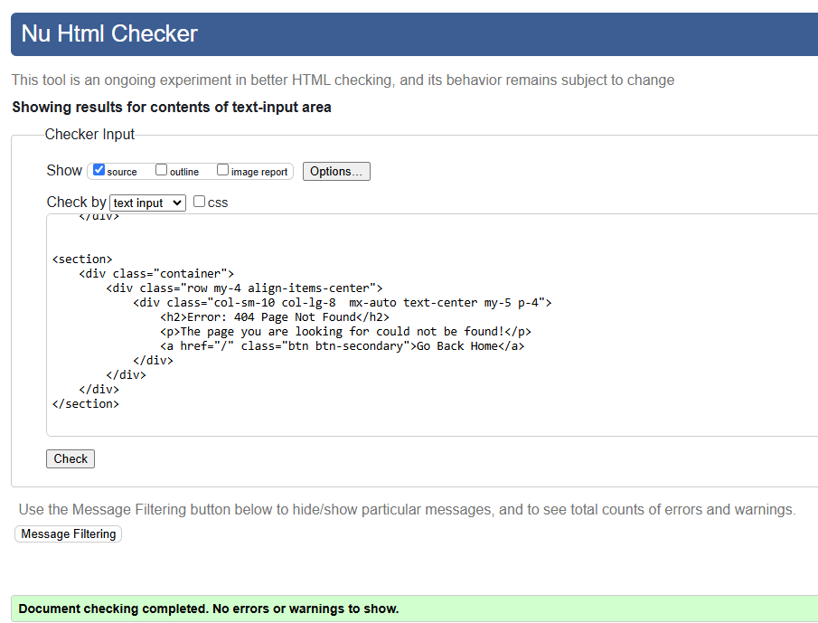       | Pass      |

### CSS

| File     | Screenshot                                                   | Result |
| -------- | ------------------------------------------------------------ | ------ |
| main.css | 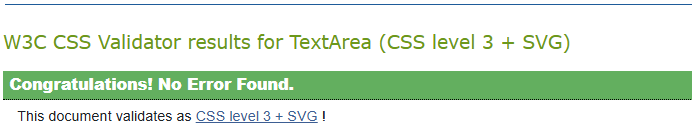 | Pass   |

### JavaScript

| File     | Screenshot                                                    | Result |
| -------- | ------------------------------------------------------------- | ------ |
| main.css | 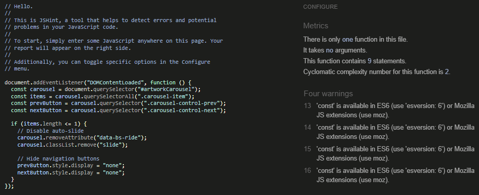 | Pass   |

### Python

Validation for Artisan Alley App. Auto-generated files (wsgi,agi, etc) are not added.

| File        | Screenshot                                               | Result              |
| ----------- | -------------------------------------------------------- | ------------------- |
| settings.py | 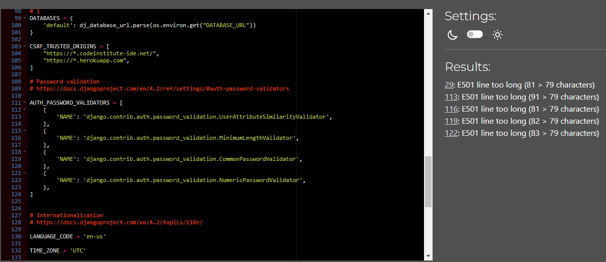 | Auto generated code |
| urls.py     | 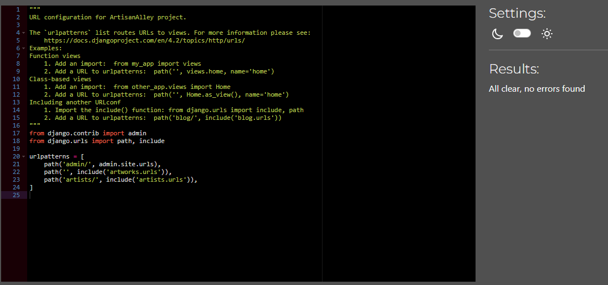           | Pass                |

Validation for Artworks App. Auto-generated files are not added.

| File      | Screenshot                                                | Result |
| --------- | --------------------------------------------------------- | ------ |
| forms.py  | 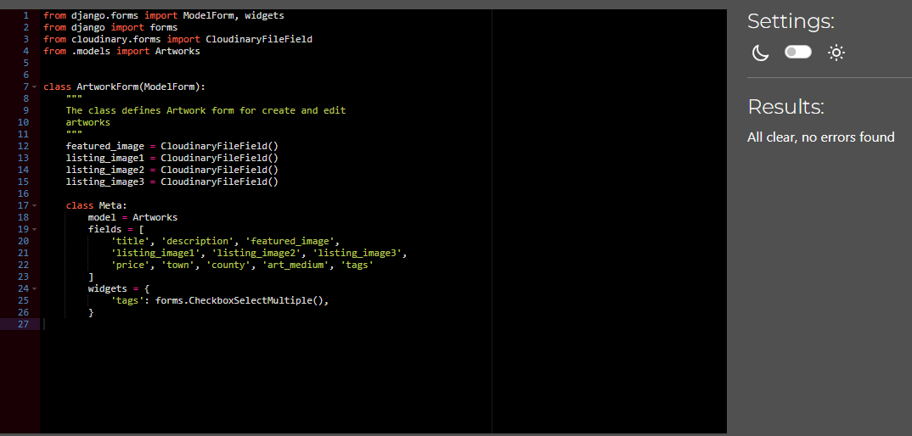          | Pass   |
| urls.py   | 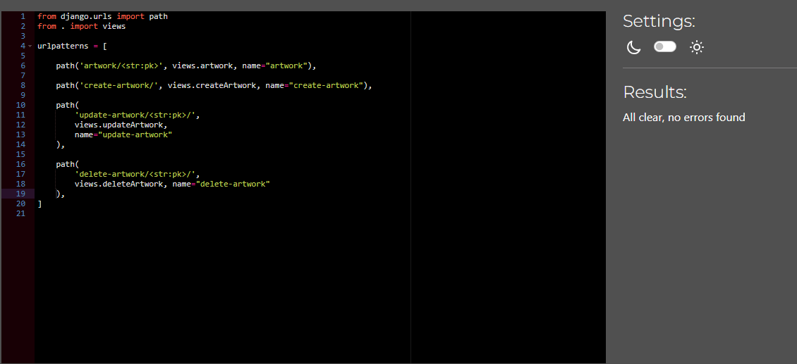     | Pass   |
| models.py | 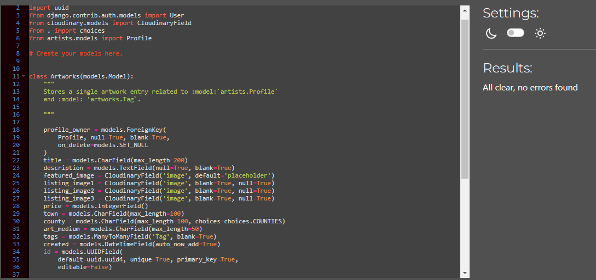 | Pass   |
| views.py  | 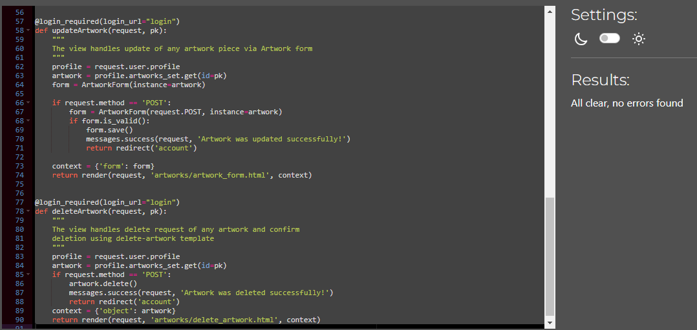   | Pass   |
| utils.py  | 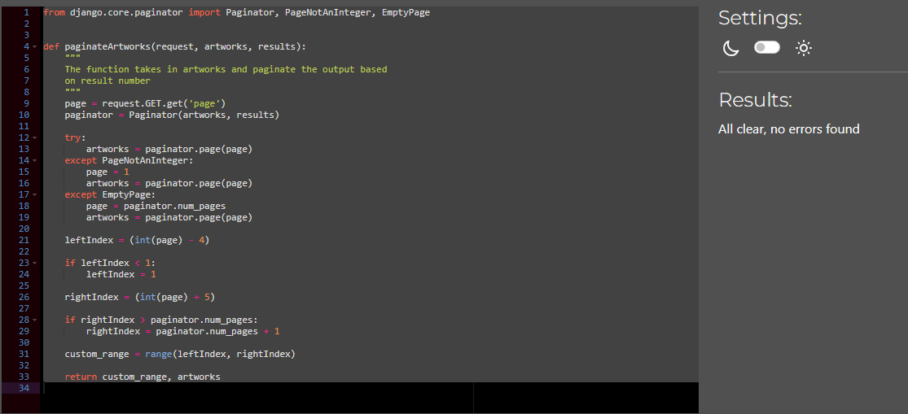   | Pass   |
