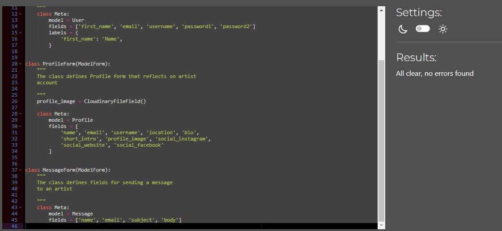
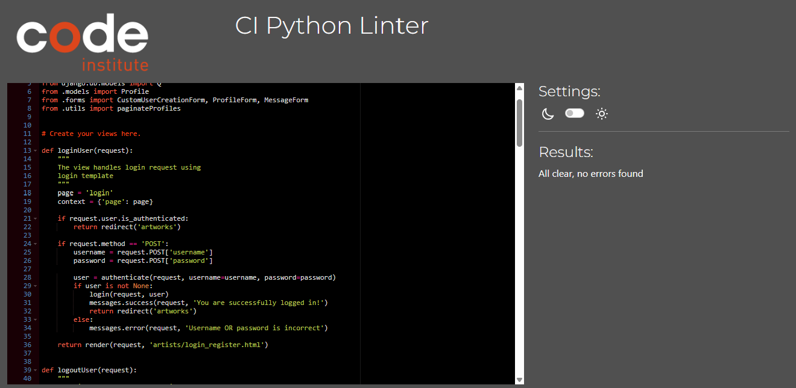

# Artisan Alley - Testing

This page contains all the testing details the website was run through

## Code Validation

### HTML

| Page                | Screenshot                                                              | Result    |
| ------------------- | ----------------------------------------------------------------------- | --------- |
| Home                |                | Pass      |
| Artists             |         | Pass      |
| Single- Artwork     |       | Pass      |
| Artist Profile      |  | Pass      |
| Login               |                   | Pass      |
| Register            |             | Pass      |
| Create/Edit Artwork |         | Bug (#26) |
| Account             |            | Pass      |
| Inbox               |                   | Pass      |
| Create/Edit Account |      | Pass      |
| Send Message        |          | Pass      |
| Delete Artwork      |         | Pass      |
| Error Pages         |        | Pass      |

### CSS

| File     | Screenshot                                                   | Result |
| -------- | ------------------------------------------------------------ | ------ |
| main.css |  | Pass   |

### JavaScript

| File     | Screenshot                                                    | Result |
| -------- | ------------------------------------------------------------- | ------ |
| main.css |  | Pass   |

### Python

Validation for Artisan Alley App. Auto-generated files (wsgi,agi, etc) are not added.

| File        | Screenshot                                               | Result              |
| ----------- | -------------------------------------------------------- | ------------------- |
| settings.py |  | Auto generated code |
| urls.py     |            | Pass                |

Validation for Artworks App. Auto-generated files are not added.

| File      | Screenshot                                                | Result |
| --------- | --------------------------------------------------------- | ------ |
| forms.py  |           | Pass   |
| urls.py   |      | Pass   |
| models.py |  | Pass   |
| views.py  |    | Pass   |
| utils.py  |    | Pass   |

Validation for Artists App. Auto-generated files are not added

| File       | Screenshot                                               | Result |
| ---------- | -------------------------------------------------------- | ------ |
| forms.py   |    | Pass   |
| urls.py    |      | Pass   |
| models.py  |  | Pass   |
| views.py   |    | Pass   |
| utils.py   |    | Pass   |
| signals.py |      | Pass   |

## Lighthouse Testing

#### Artists - Desktop

#### Artists - Mobile

#### Account - Desktop

#### Account - Mobile

#### Single Artwork - Desktop

#### Single Artwork - Mobile

#### Artist Profile - Desktop

#### Artist Profile - Mobile

## Manual Testing

### User Story Testing

#### Developer Stories

- [x] Frontend and Backend of the Project
- [x] Implementing Cloudinary for image storage and postgres for database
- [x] Deployment on Heroku and setting secret keys

#### User Stories

- [x] Register/Login
- [x] View Paginated Artworks
- [x] View Paginated Artists
- [x] Search Artist based on location and name
- [x] Create an Account
- [x] Publish an artwork
- [x] Edit an Artwork
- [x] Delete and Artwork
- [x] Edit personal Account
- [x] Message other Artists
- [x] Logout from Platform

### Testing Devices

Testing was performed on:

- Laptop

  - Lenovo Yoga 9

- Desktop Screen

  - 29 inch ViewSonic Screen (4k Monitor)

- Browsers
  - Google Chrome

### Manual Feature Tests

| Section        | Test Action                                           | Expected Result                                     | Pass/Fail |
| -------------- | ----------------------------------------------------- | --------------------------------------------------- | --------- |
| Navbar         | Click on Logo in Navbar                               | Redirect to Home                                    | Pass      |
|                | Click on Arworks link in Navbar                       | Redirect to Home                                    | Pass      |
|                | Click on Artists link in Navbar                       | Redirect to Artists Page                            | Pass      |
|                | Click on Login link in Navbar                         | Redirect to Login Page                              | Pass      |
|                | Click on Register Page on Navbar                      | Redirect to Register Page                           | Pass      |
|                | Click on Add Artwork on Navbar                        | Opens artwork Form to add details                   | Pass      |
|                | Click on Inbox on Navbar                              | Redirect to messages received                       | Pass      |
|                | Click on Account on Navbar                            | Redirect to Profile Page                            | Pass      |
| Search         | Add name or location                                  | Display results based on query                      | Pass      |
| Artworks       | Scroll down to see newly added artworks are displayed | The new artworks are displayed                      | Pass      |
| Single-Artwork | Click on Artwork Card                                 | Redirect to details on artwork                      | Pass      |
| Artist Profile | Click on Artist Card                                  | Opens up Artist Profile with details                | Pass      |
| Send Message   | Click on Send Message on Artist Profile               | Opens up message box to type                        | Pass      |
| Contact Artist | Click on Contact Artist on Single Artwork             | Redirects to Artist Profile Page                    | Pass      |
| Edit Account   | Click on Edit Account on Profile Page                 | Opens Edit Profile with populated fields            | Pass      |
| Pagination     | Click on all links in the pagination                  | Opens up correct page                               | Pass      |
| Add Artwork    | Click on Add Artwork to fill details                  | All required details to be filled before submission | Pass      |
| Footer         | Click on social links in Footer                       | All links open correct page in new tab              | Pass      |
| Edit-Artwork   | Click on Edit Artwork on Account Page                 | Opens Artwork forms pre-populated fields            | Pass      |
| Delete-Artwork | Click on Delete Artwork on Account Page               | Shows a confirmation message to delele              | Pass      |

### Tests on Round 2
| Section        | Test Action                                           | Expected Result                                     | Pass/Fail |
| -------------- | ----------------------------------------------------- | --------------------------------------------------- | --------- |
| Register | Create a new account with new credentials | Redirects to Profile page | Pass |
| Login | Login with case-sensitive user credentials | Opens Home page | Pass |
|       | Login with incorrect credentials | Shows an error message - incorrect username password | Pass |

## Struggles, Learnings and Bugs

This project was a little struggle to bring to completion. I had a great experience learning on Django and discovered UX/UI are not my favorite topics.

1. Handling image have been a struggle. Their size often effects the page load and I still have not found a right solution for it.
2. Working with Django Forms was a good learning experience, I came to know about Django-Widget Tweaks library but also had issues dealing with displaying checkboxes with it.
3. Working with milestones was a great experience. Connecting user story issues with commits was a first time experience which I realised later it was leading to larger commits
4. Dennis Ivy's course on Django was a great help.
5. Database Migrations were a good challenge. Learnt about Beekeeper Studio that can show me inside of the database. Learnt how to make fake migrations to resolve migration history errors
6. I discovered while lighthouse testing that I struggle with projects that use images. I would like to learn how to process images for better site performance. Reducing size has not always been helpful.

| KNOWN BUGS                                                                                               | Open/Close |
| -------------------------------------------------------------------------------------------------------- | ---------- |
| [Tag Field with Hidden Label #26](https://github.com/hennasingh/ArtisanAlley/issues/26)                  | Open       |
| [Image Carousel does not stop on single image #23](https://github.com/hennasingh/ArtisanAlley/issues/23) | Open       |
| [Artwork Created without Profile Owner #30](https://github.com/hennasingh/ArtisanAlley/issues/30)        | Open       |
